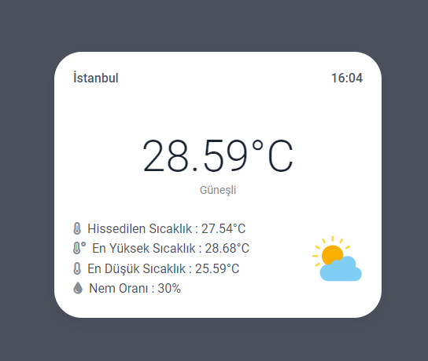

# Weather - App
API olarak OpenWeatherAPI kullanarak birer simple api entegrasyon uygulaması yazdım.
Bu projeyi kullanabilmek için OpenWeather'ın sitesine gidip kayıt olup birer api key almanız 
gerekmektedir. 

OpenWeather Url = https://home.openweathermap.org/

Proje Kurulumu:

- cd Weather-App
- composer install
- symfony server:start

